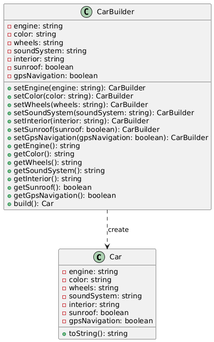

# Problema 1

## Escenario
Imagina que estás desarrollando una aplicación para una compañía automotriz que permite a los clientes personalizar y ordenar un automóvil. Un objeto Automóvil puede tener muchas configuraciones opcionales: tipo de motor, color, llantas, sistema de sonido, interiores, techo solar, navegación GPS, etc.

## Guía de actividad
### Problema
Crear un objeto Automóvil con múltiples configuraciones puede llevar a constructores con muchos parámetros (el infame "constructor telescópico") o a múltiples constructores sobrecargados, lo que dificulta el mantenimiento y legibilidad del código.

### Beneficios esperados de la solución:
- **Legibilidad y claridad**: Facilitar la creación de objetos complejos con muchos parámetros sin necesidad de múltiples constructores o valores por defecto.
- **Inmutabilidad**: Una vez creado el objeto, sus propiedades no se pueden modificar si el constructor lo define como inmutable.
- **Flexibilidad**: Poder omitir atributos opcionales sin necesidad de crear subclases o múltiples constructores.
- **Separación de construcción y representación**: Separar la lógica de construcción del objeto en sí, facilitando modificaciones futuras.
## Patrón de Diseño Utilizado

**Patrón Builder (Creacional)**

### Justificación
El patrón Builder es ideal para este escenario porque resuelve el problema del "constructor telescópico" que se presenta al tener múltiples parámetros opcionales (motor, color, llantas, etc.). Permite construir objetos complejos paso a paso con una sintaxis fluida y legible, facilitando la omisión de atributos opcionales sin crear múltiples constructores sobrecargados. Además, garantiza la inmutabilidad del objeto final una vez construido.

## Diagrama de clases

