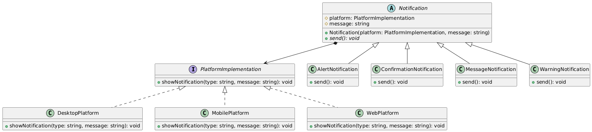

# Problema 2

## Escenario
Estás desarrollando una aplicación que gestiona la visualización de notificaciones en diferentes plataformas (por ejemplo: escritorio, móvil, web). Las notificaciones pueden ser de distintos tipos (mensaje, alerta, advertencia, confirmación) y cada tipo puede mostrarse de distintas formas según la plataforma.

## Guía de actividad
### Problema
Si usas herencia tradicional, tendrías que crear clases como: NotificacionMensajeWeb, NotificacionAlertaWeb, NotificacionMensajeMovil, NotificacionAlertaMovil, etc. Esto lleva rápidamente a una explosión combinatoria de subclases difíciles de mantener.

### Beneficios esperados de la solución:
- **Separación de responsabilidades**: Separar la lógica de la notificación del medio por el que se presenta.
- **Escalabilidad**: Poder agregar nuevas plataformas o tipos de notificación sin modificar el resto del sistema.
- **Reducción de clases**: Evitar la multiplicación de clases para cada combinación.
- **Flexibilidad en tiempo de ejecución**: Poder cambiar la plataforma dinámicamente si es necesario.
## Patrón de Diseño Utilizado

**Patrón Bridge (Estructural)**

### Justificación
El patrón Bridge es la solución perfecta para evitar la "explosión combinatoria" de clases mencionada en el problema (NotificacionMensajeWeb, NotificacionAlertaMovil, etc.). Separa la abstracción (tipos de notificación) de su implementación (plataformas), permitiendo que ambas jerarquías varíen independientemente. Esto facilita agregar nuevos tipos de notificación o plataformas sin modificar el código existente, siguiendo el principio Abierto/Cerrado.

## Diagrama de clases

