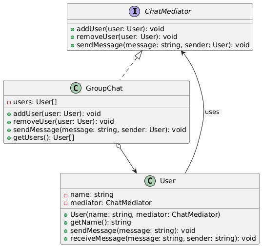

# Problema 3

## Escenario
Estás desarrollando una aplicación de chat grupal. Los usuarios pueden enviarse mensajes entre sí dentro de una sala de chat. Sin embargo, gestionar las interacciones directas entre cada usuario haría que cada uno deba conocer y comunicarse con todos los demás, lo que resulta en una alta dependencia entre objetos.

## Guía de actividad
### Problema
Sin un mediador, cada usuario tendría que mantener referencias directas a todos los demás, lo que genera un sistema difícil de escalar y mantener. Si agregas o eliminas usuarios, debes actualizar muchas relaciones.

### Beneficios esperados de la solución:
1. **Facilita el mantenimiento**: Agregar o eliminar usuarios no debe requerir modificar los demás.
2. **Mejor organización**: La lógica de comunicación debe estar centralizada, no dispersa en muchos objetos.
3. **Reduce la complejidad**: Evitar una red enmarañada de interacciones punto a punto.
## Patrón de Diseño Utilizado

**Patrón Mediator (Comportamental)**

### Justificación
El patrón Mediator resuelve el problema de alta dependencia entre usuarios del chat, donde cada usuario tendría que mantener referencias directas a todos los demás. El mediador (GroupChat) centraliza toda la comunicación, eliminando las dependencias directas entre usuarios. Esto simplifica el sistema, facilita agregar/eliminar usuarios sin afectar a otros, y centraliza la lógica de comunicación en un solo lugar, mejorando la mantenibilidad y escalabilidad.

## Diagrama de clases

